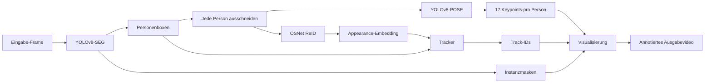
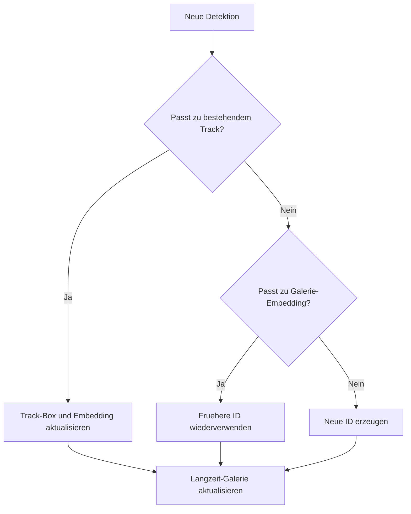

# Person-Tracking-System

YOLOv8-SEG + YOLOv8-POSE + OSNet ReID + IoU/ReID-Tracking mit Langzeit-Galerie zur Wiederverwendung von IDs.

## Was Dieses Projekt Macht

Dieses Projekt verfolgt Personen in Videos und versucht, ihre Identität über die Zeit stabil zu halten. Es kombiniert:

- Personenerkennung
- Instanzsegmentierung
- Pose-Schätzung
- erscheinungsbasierte Re-Identifikation
- Multi-Object-Tracking
- langfristige Wiederherstellung von IDs nach Verschwinden oder Verdeckung

Das Ergebnis ist ein Video mit:

- Personenmasken
- Bounding Boxes
- persistenten IDs
- COCO-17-Pose-Skeletten

Beispielausgabe: [`output_tracked_pose_seg.mp4`](./output_tracked_pose_seg.mp4)

## Visuelle Übersicht



## ID-Lebenszyklus



## Repository Im Überblick

```text
.
├── .gitignore             # Git- und Qt-Creator-Ignore-Regeln
├── Person_tracking.pro    # Qt-Creator- / qmake-Projektdatei
├── README.md              # Englische Dokumentation
├── README.de.md           # Deutsche Dokumentation
└── main.cpp               # Gesamte Pipeline-Implementierung
```

## Schnellstart

### Bevorzugt: Qt Creator

Dieses Projekt wird hauptsaechlich ueber Qt Creator verwendet.

1. `Person_tracking.pro` in Qt Creator oeffnen.
2. Qt Creator das qmake-Projekt konfigurieren lassen.
3. Sicherstellen, dass die OpenCV- und ONNX-Runtime-Pfade in `Person_tracking.pro` zu deinem System passen.
4. Das Projekt in Qt Creator bauen.
5. Das Projekt in Qt Creator starten.

### Hinweise Zur Projektdatei

`Person_tracking.pro`:

- aktiviert C++17
- bindet OpenCV ueber `pkg-config` ein
- bindet ONNX Runtime ueber einen lokalen Installationspfad ein
- setzt `rpath` fuer ONNX Runtime zur Laufzeit

### Laufkonfiguration

Passe zuerst die Pfade in `main()` an:

- Pfad zum YOLOv8-Segmentierungsmodell
- Pfad zum YOLOv8-Pose-Modell
- Pfad zum OSNet-ReID-Modell
- Pfad zum Eingabevideo
- Pfad zum Ausgabevideo

Dann ausfuehren:

```bash
./app
```

### Alternative: Build Im Terminal

Falls du Qt Creator nicht verwendest, kannst du auch manuell bauen:

```bash
g++ main.cpp -O2 -std=c++17 `pkg-config --cflags --libs opencv4` -lonnxruntime -o app
```

## Ein- Und Ausgaben

### Eingabe

- eine Videodatei
- ein YOLOv8-Segmentierungsmodell im ONNX-Format
- ein YOLOv8-Pose-Modell im ONNX-Format
- ein OSNet-ReID-Modell im ONNX-Format

### Ausgabe

- ein Visualisierungsfenster
- optional ein gespeichertes Video mit Masken, Boxes, IDs und Pose-Overlays

## Pipeline Im Ablauf

### 1. Personenerkennung Und Segmentierung

Implementiert in `detectPersonsYOLOv8Seg()`.

Dieser Schritt:

- skaliert das Frame auf die Eingabegroesse des Segmentierungsmodells
- fuehrt YOLOv8-SEG aus
- dekodiert Personen-Detektionen
- rekonstruiert Instanzmasken aus Masken-Koeffizienten und Prototypen
- fuehrt NMS zum Entfernen ueberlappender Detektionen aus

Jede gueltige Detektion wird zu einem `Det`-Objekt mit:

- `box`
- `conf`
- `mask_u8`

### 2. ReID-Embedding-Extraktion

Implementiert in `ReIDExtractor::extract()`.

Fuer jede erkannte Person macht der Code:

- Ausschneiden des Personenbereichs
- Skalierung auf `128 x 256`
- Umwandlung von BGR nach RGB
- Normalisierung mit ImageNet-aehnlichem Mittelwert und Standardabweichung
- Ausfuehrung des OSNet-ONNX-Modells
- L2-Normalisierung des Ausgabe-Embeddings

Das Embedding wird in `Det.emb` gespeichert.

### 3. Pose-Schaetzung

Implementiert in `runPoseOnCropYOLOv8()`.

Anstatt die Pose auf dem gesamten Frame auszufuehren, laeuft YOLOv8-POSE auf jedem Personenausschnitt. Dadurch wird die Zuordnung der Keypoints meist robuster, weil ein Ausschnitt in der Regel nur eine Person enthaelt.

Fuer den besten Pose-Kandidaten speichert der Code:

- `kps`
- `kp_conf`

### 4. Tracking Und Langzeit-Wiederherstellung Von IDs

Implementiert in `Tracker::step()`.

Der Tracker nutzt:

- IoU fuer geometrische Konsistenz
- Kosinus-Distanz fuer Erscheinungsaehnlichkeit

Er arbeitet mit zwei Speicherebenen:

- kurzlebige aktive Tracks
- langfristige Galerie-Embeddings

Wenn eine Person verschwindet und spaeter wieder auftaucht, kann der Tracker ueber die Galerie die alte ID wiederherstellen.

### 5. Visualisierung

Das Zeichnen erfolgt ueber:

- `blend_all_masks_once()`
- `draw_pose()`
- den Zeichenblock in `main()`

Das finale Frame enthaelt:

- Segmentierungsmasken
- Personen-Bounding-Boxes
- Track-ID-Labels
- Pose-Skelette

## Code-Map

| Bereich | Wo lesen |
| --- | --- |
| Datenstruktur fuer Detektionen | `struct Det` |
| ReID-Vorverarbeitung und Inferenz | `struct ReIDExtractor` |
| Segmentierungsdekodierung | `detectPersonsYOLOv8Seg()` |
| Pose-Dekodierung | `runPoseOnCropYOLOv8()` |
| aktive Tracks und Galerie-Logik | `struct Tracker` |
| Skelett-Zeichnung | `draw_pose()` |
| Masken-Overlay | `blend_all_masks_once()` |
| kompletter End-to-End-Ablauf | `main()` |

## Zentrale Datenstrukturen

### `Det`

Repraesentiert eine Personen-Detektion im aktuellen Frame.

- `box`: Bounding Box
- `conf`: Detektionskonfidenz
- `emb`: ReID-Embedding
- `mask_u8`: binaere Vollbildmaske
- `kps`: Pose-Keypoints
- `kp_conf`: Keypoint-Konfidenzen

### `Track`

Repraesentiert eine aktive verfolgte Identitaet.

- `id`: persistente Personen-ID
- `box`: letzte Bounding Box
- `emb`: geglaettetes Appearance-Embedding
- `time_since_update`: Anzahl der Frames seit dem letzten erfolgreichen Match

### `GalleryItem`

Repraesentiert das Langzeitgedaechtnis einer Identitaet.

- `emb`: langfristiges Appearance-Embedding
- `last_seen_frame`: letzter aktualisierter Frame-Index

## Modellannahmen

### YOLOv8-SEG

Erwartete Ausgaben:

- `pred: [1, C, N]`
- `proto: [1, nm, mh, mw]`

Unterstuetzte Kanal-Layouts:

- `C = 4 + nc + nm`
- `C = 5 + nc + nm`

Aktuelle Annahmen:

- COCO-aehnliches Klassenlayout
- `nc = 80`
- `person class id = 0`

### YOLOv8-POSE

Erwartete haeufige Ausgabeform:

- `[1, C, N]`

Der Code erkennt den Startindex der Keypoints fuer haeufige Exporte wie:

- `[cx, cy, w, h, score, 17*3]`
- `[cx, cy, w, h, obj, cls?, 17*3]`

### OSNet ReID

Erwartetes Verhalten:

- Personenausschnitt als Eingabe
- Embedding-Vektor als Ausgabe
- L2-Normalisierung vor dem Matching

## Hinweise Zum Tuning

Die wichtigsten Parameter sind:

- Detektions-Konfidenzschwelle
- NMS-IoU-Schwelle
- Pose-Detektionsschwelle
- `max_age` des Trackers
- Kosinus-Distanzschwellen des Trackers
- Kosinus-Schwelle der Galerie

Wenn IDs zu instabil sind:

- Appearance-Distanzschwellen senken
- `max_age` erhoehen
- ein staerkeres ReID-Modell verwenden

Wenn alte IDs zu selten wiederverwendet werden:

- `gallery_cos_thresh` leicht erhoehen

## Aktuelle Einschraenkungen

- Modell- und Videopfade sind fest in `main()` hinterlegt
- die komplette Pipeline liegt in einer einzigen Quelldatei
- `Person_tracking.pro` enthaelt maschinenspezifische ONNX-Runtime-Pfade
- die Modellannahmen sind auf haeufige YOLOv8-ONNX-Formate zugeschnitten, nicht auf jede moegliche Variante
- es gibt noch keine Konfiguration ueber Kommandozeile

## Sinnvoller Naechster Refactor

Wenn das Projekt weiter wachsen soll, waere der naechste sinnvolle Schritt, `main.cpp` aufzuteilen in:

- `detector.cpp/.h`
- `pose.cpp/.h`
- `reid.cpp/.h`
- `tracker.cpp/.h`
- `visualization.cpp/.h`
- `config.cpp/.h`

Das wuerde Testbarkeit, Tuning und weitere Dokumentation deutlich erleichtern.
