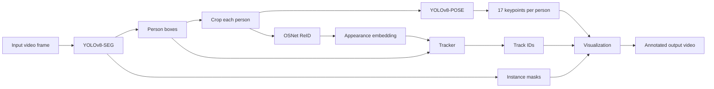
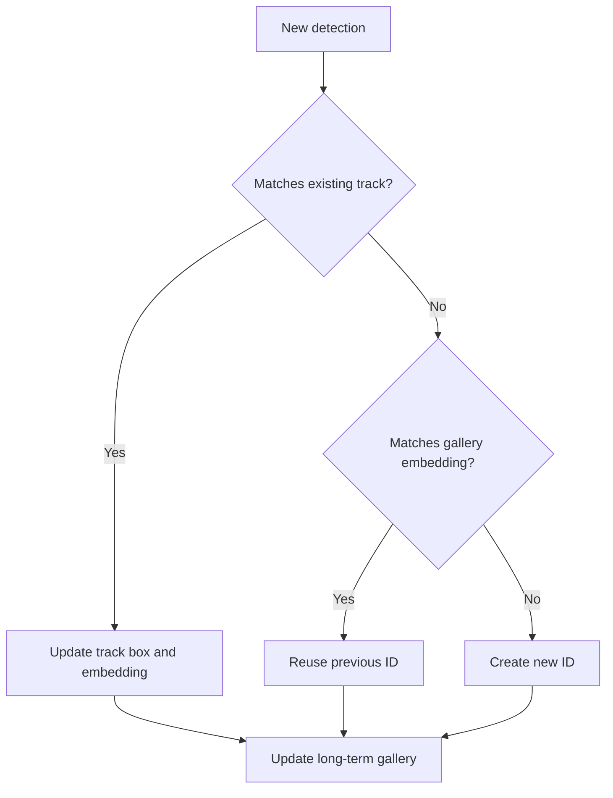

# Person Tracking System

YOLOv8-SEG + YOLOv8-POSE + OSNet ReID + IoU/ReID tracking with a long-term gallery for ID recovery.

## What This Project Does

This project tracks people in video and keeps their identities stable over time. It combines:

- person detection
- instance segmentation
- pose estimation
- appearance-based re-identification
- multi-object tracking
- long-term ID recovery after disappearance or occlusion

The result is a video with:

- person masks
- bounding boxes
- persistent IDs
- COCO-17 pose skeletons

Example output: [`output_tracked_pose_seg.mp4`](./output_tracked_pose_seg.mp4)

## Visual Overview



## ID Lifecycle



## Repository At A Glance

```text
.
├── .gitignore             # Git and Qt Creator ignore rules
├── Person_tracking.pro    # Qt Creator / qmake project file
├── README.md              # English documentation
├── README.de.md           # German documentation
├── config.cpp/.h          # Runtime paths, thresholds, and app settings
├── detector.cpp/.h        # YOLOv8-SEG decoding and Det structure
├── pose.cpp/.h            # YOLOv8-POSE crop inference
├── reid.cpp/.h            # OSNet ReID extraction
├── tracker.cpp/.h         # IoU/ReID tracking and gallery logic
├── visualization.cpp/.h   # Masks, skeletons, and overlays
└── main.cpp               # Pipeline orchestration entry point
```

## Quick Start

### Preferred: Qt Creator

This project is mainly used through Qt Creator.

1. Open `Person_tracking.pro` in Qt Creator.
2. Let Qt Creator configure the qmake project.
3. Make sure the OpenCV and ONNX Runtime paths in `Person_tracking.pro` match your machine.
4. Build the project from Qt Creator.
5. Run it from Qt Creator.

### Project File Notes

`Person_tracking.pro` currently:

- enables C++17
- links OpenCV through `pkg-config`
- links ONNX Runtime from a local installation path
- adds runtime `rpath` for ONNX Runtime

### Run Configuration

Update the paths inside `main()` first:

- YOLOv8 segmentation model path
- YOLOv8 pose model path
- OSNet ReID model path
- input video path
- output video path

Then run:

```bash
./app
```

### Alternative: Terminal Build

If you do not use Qt Creator, you can still build manually:

```bash
g++ main.cpp config.cpp detector.cpp pose.cpp reid.cpp tracker.cpp visualization.cpp \
  -O2 -std=c++17 \
  -I/home/mosta/Downloads/onnxruntime-linux-x64-1.24.2/include \
  `pkg-config --cflags --libs opencv4` \
  -L/home/mosta/Downloads/onnxruntime-linux-x64-1.24.2/lib \
  -Wl,-rpath,/home/mosta/Downloads/onnxruntime-linux-x64-1.24.2/lib \
  -lonnxruntime -lpthread -ldl -o app
```

## Inputs And Outputs

### Input

- a video file
- a YOLOv8 segmentation ONNX model
- a YOLOv8 pose ONNX model
- an OSNet ReID ONNX model

### Output

- a displayed visualization window
- an optional saved video with masks, boxes, IDs, and pose overlays

## Pipeline Walkthrough

### 1. Person Detection And Segmentation

Implemented in `detectPersonsYOLOv8Seg()`.

This step:

- resizes the frame to the segmentation model input
- runs YOLOv8-SEG
- decodes person detections
- reconstructs instance masks from mask coefficients and prototypes
- applies NMS to remove overlapping detections

Each valid detection becomes a `Det` object containing:

- `box`
- `conf`
- `mask_u8`

### 2. ReID Embedding Extraction

Implemented in `ReIDExtractor::extract()`.

For each detected person, the code:

- crops the person region
- resizes it to `128 x 256`
- converts BGR to RGB
- normalizes with ImageNet-style mean and std
- runs the OSNet ONNX model
- L2-normalizes the output embedding

The embedding is stored in `Det.emb`.

### 3. Pose Estimation

Implemented in `runPoseOnCropYOLOv8()`.

Instead of running pose on the full frame, the system runs YOLOv8-POSE on each detected person crop. This improves keypoint association because each crop usually contains only one person.

For the best pose candidate, the code stores:

- `kps`
- `kp_conf`

### 4. Tracking And Long-Term ID Recovery

Implemented in `Tracker::step()`.

The tracker uses:

- IoU for geometric consistency
- cosine distance for appearance similarity

It supports two memory levels:

- short-term active tracks
- long-term gallery embeddings

If a person disappears and later reappears, the tracker can recover the old ID by matching the new embedding against the gallery.

### 5. Visualization

Drawing is handled by:

- `blend_all_masks_once()`
- `draw_pose()`
- the drawing block in `main()`

The final frame includes:

- segmentation masks
- person bounding boxes
- track ID labels
- pose skeletons

## Code Map

| Area | Where to read |
| --- | --- |
| detection data structure | `struct Det` |
| ReID preprocessing and inference | `struct ReIDExtractor` |
| segmentation decoding | `detectPersonsYOLOv8Seg()` |
| pose decoding | `runPoseOnCropYOLOv8()` |
| active tracking and gallery logic | `struct Tracker` |
| skeleton rendering | `draw_pose()` |
| mask overlay rendering | `blend_all_masks_once()` |
| end-to-end execution flow | `main()` |

## Current Architecture

The project is now split into focused modules instead of keeping the whole pipeline in one file:

- `config.cpp/.h`: default paths, thresholds, model sizes, and window title
- `detector.cpp/.h`: `Det`, preprocessing, YOLOv8-SEG decoding, mask generation, and NMS
- `pose.cpp/.h`: per-person pose inference and keypoint decoding
- `reid.cpp/.h`: OSNet preprocessing and embedding extraction
- `tracker.cpp/.h`: active track matching and long-term gallery reuse
- `visualization.cpp/.h`: mask blending and pose drawing
- `main.cpp`: initializes sessions, runs the pipeline loop, and renders output

## Core Data Structures

### `Det`

Represents one person detection in the current frame.

- `box`: bounding box
- `conf`: detection confidence
- `emb`: ReID embedding
- `mask_u8`: full-frame binary mask
- `kps`: pose keypoints
- `kp_conf`: pose keypoint confidences

### `Track`

Represents one active tracked identity.

- `id`: persistent person ID
- `box`: latest bounding box
- `emb`: smoothed appearance embedding
- `time_since_update`: frames since the last successful match

### `GalleryItem`

Represents long-term identity memory.

- `emb`: long-term appearance embedding
- `last_seen_frame`: most recent frame index for that identity

## Model Assumptions

### YOLOv8-SEG

Expected outputs:

- `pred: [1, C, N]`
- `proto: [1, nm, mh, mw]`

Supported channel layouts:

- `C = 4 + nc + nm`
- `C = 5 + nc + nm`

Current assumptions:

- COCO-style class layout
- `nc = 80`
- `person class id = 0`

### YOLOv8-POSE

Expected common output shape:

- `[1, C, N]`

The code infers the keypoint start index for common exports such as:

- `[cx, cy, w, h, score, 17*3]`
- `[cx, cy, w, h, obj, cls?, 17*3]`

### OSNet ReID

Expected behavior:

- person crop input
- embedding vector output
- L2 normalization before matching

## Tuning Notes

The main parameters to adjust are:

- detection confidence threshold
- detection NMS IoU threshold
- pose detection threshold
- tracker `max_age`
- tracker cosine distance thresholds
- gallery cosine threshold

If IDs are too unstable:

- lower appearance distance thresholds
- raise `max_age`
- improve ReID model quality

If old IDs are not reused often enough:

- slightly relax `gallery_cos_thresh`

## Current Limitations

- model and video paths are hard-coded in `main()`
- default paths and thresholds are still hard-coded in `config.cpp`
- `Person_tracking.pro` contains machine-specific ONNX Runtime paths
- model export assumptions are tuned to common YOLOv8 ONNX formats, not every possible variant
- there is no command-line configuration yet

## Suggested Next Steps

The most useful next improvements would be:

- move runtime paths and thresholds from `config.cpp` to CLI arguments or a config file
- add `.gitignore` entries for generated files such as `app` and large output videos
- separate documentation-only files from code changes when committing
- add a small sample input plus expected output screenshots for easier onboarding
